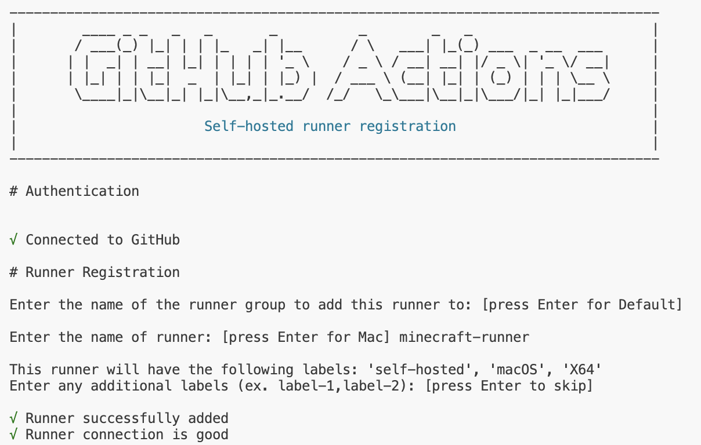

# Setting Up a Self-Hosted GitHub Runner
This guide walks you through the process of creating and configuring a self-hosted runner for your GitHub repository.

## Prerequisites

- Access to a GitHub repository
- A machine where you want to host the runner
- Bash terminal (I use VS Code)

## Setting it Up 

1. Create a New Repository
2. Setup to Create New Runner
  - Open your repository
  - Click on the "Settings" tab
  - Expand the "Actions" section
  - Select "Runners"
    You will see a list of existing runners (if any)

4. Add a New Self-Hosted Runner

  - Click the "New self-hosted runner" button

5. Select Your Operating System

  - Choose your machine's operating system (Windows, Linux, macOS). Note: You can setup Linux using WSL
  - GitHub will display specific installation commands

6. Install the Runner

  - Open a bash terminal
  - Copy and paste the provided GitHub runner installation commands

7. Verify Runner Installation

  - Refresh the GitHub repository settings page
  - Check the "Runners" section
  - Your new self-hosted runner should now be listed and ready to use

